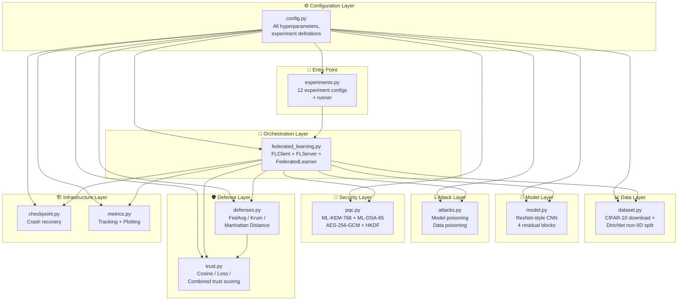
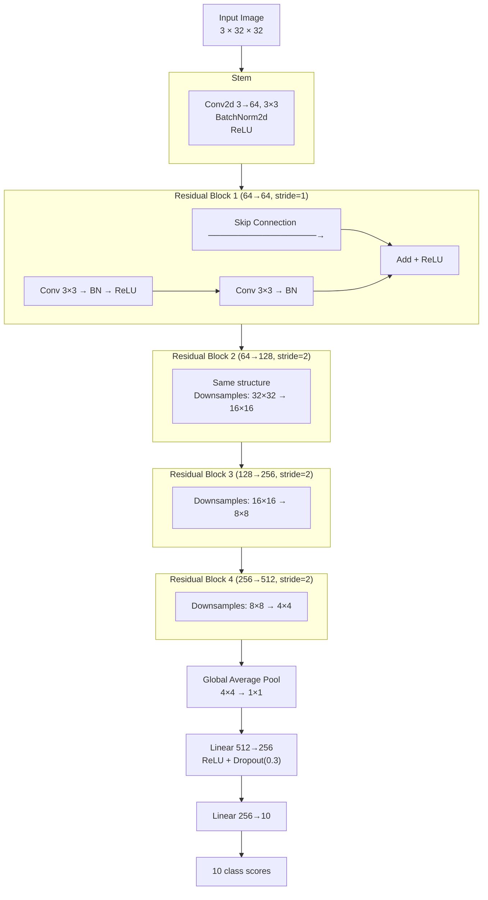
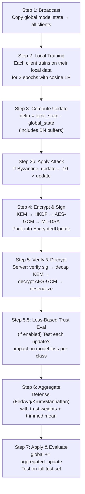
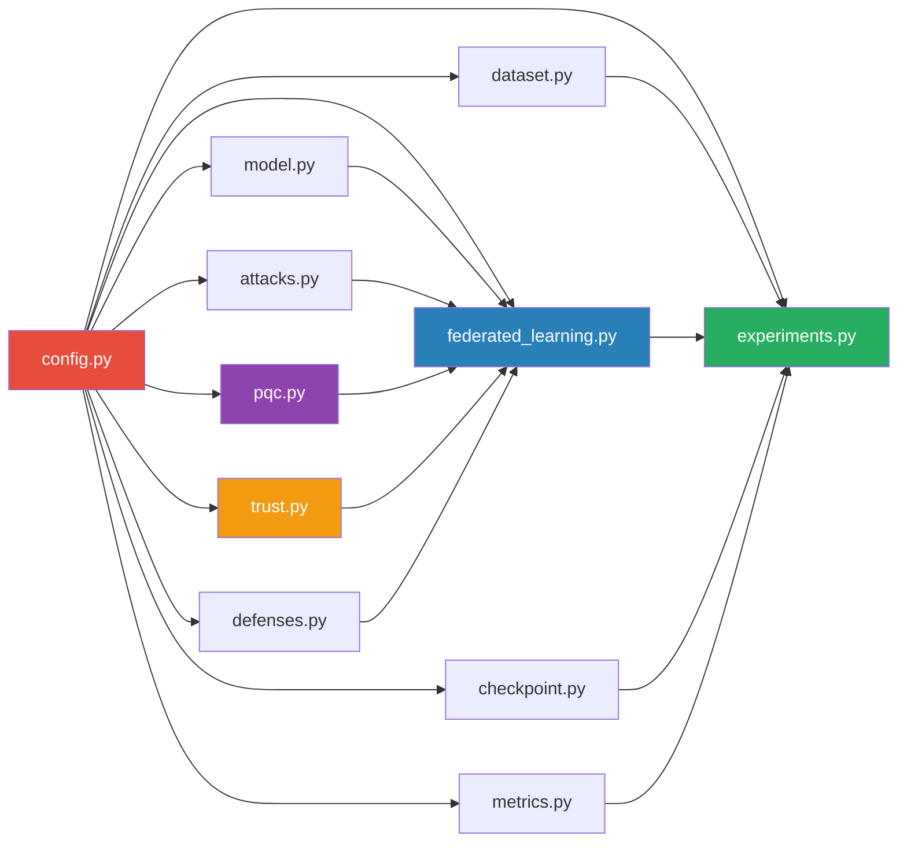

# Project Architecture — Complete Detailed Walkthrough

## High-Level Architecture Diagram



---

## Module-by-Module Detailed Explanation

---

### 1. `config.py` — The Control Center

📍 [config.py](file:///c:/Users/chanikya/Desktop/btp/config.py)

This file contains **every single setting** the project uses. Nothing is hardcoded elsewhere — everything reads from here.

| Section | Key Settings | Purpose |
|---|---|---|
| **Federated Learning** | `NUM_ROUNDS=50`, `LOCAL_EPOCHS=3`, `NUM_CLIENTS=10`, `BATCH_SIZE=64`, `LEARNING_RATE=0.01` | Controls the training loop |
| **Dataset** | `DIRICHLET_ALPHA=1.0`, `NUM_CLASSES=10` | Controls how unevenly data is split among clients |
| **Attacks** | `BYZANTINE_CLIENTS=3`, `BYZANTINE_SCALE=10.0`, `POISON_RATIO=0.5` | Controls attacker behavior |
| **PQC** | `ML_KEM_VARIANT='ML-KEM-768'`, `ML_DSA_VARIANT='ML-DSA-65'`, `PQC_ENABLED=True` | Controls encryption/signing |
| **Trust** | `TRUST_ALPHA=0.2`, `TRUST_MIN=0.1`, `TRUST_WARM_UP_ROUNDS=5`, `TRUST_TRIM_RATIO=0.3` | Controls trust scoring behavior |
| **Experiments** | `EXPERIMENTS` dict with 12 entries | Defines all experiment configurations |
| **Device** | `DEVICE='cuda' if available else 'cpu'` | Auto-detects GPU |

---

### 2. `dataset.py` — Data Loading & Non-IID Distribution

📍 [dataset.py](file:///c:/Users/chanikya/Desktop/btp/dataset.py)

#### What It Does
Downloads CIFAR-10 (50,000 training + 10,000 test images across 10 classes) and splits the training data **unevenly** among 10 clients.

#### `CIFAR10Dataset.__init__()` — [Lines 19-30](file:///c:/Users/chanikya/Desktop/btp/dataset.py#L19-L30)
Downloads the dataset and calls `_distribute_data()`.

#### `_download_data()` — [Lines 32-62](file:///c:/Users/chanikya/Desktop/btp/dataset.py#L32-L62)
- Applies **data augmentation** for training: random crop (32×32 with 4px padding), random horizontal flip
- Applies **normalization** using CIFAR-10 mean/std: `(0.4914, 0.4822, 0.4465)` and `(0.2023, 0.1994, 0.2010)`

#### `_distribute_data()` — [Lines 66-100](file:///c:/Users/chanikya/Desktop/btp/dataset.py#L66-L100)
This is the key method. Uses **Dirichlet distribution** to create non-IID splits:

```
For EACH of the 10 classes:
  1. Get all 5,000 images of this class
  2. Sample a random distribution from Dirichlet(alpha=1.0)
     → e.g., [0.25, 0.05, 0.10, 0.15, 0.03, 0.12, 0.08, 0.07, 0.10, 0.05]
     (these 10 numbers sum to 1.0)
  3. Give each client their fraction of this class's images
     → Client 0 gets 25% of cats, Client 1 gets 5% of cats, etc.
```

**`alpha` controls how uneven the split is:**
- `alpha = 100` → nearly equal (IID)
- `alpha = 1.0` → moderately uneven (your setting)
- `alpha = 0.1` → extremely uneven (some clients get almost no data from some classes)

---

### 3. `model.py` — The Neural Network

📍 [model.py](file:///c:/Users/chanikya/Desktop/btp/model.py)

#### Architecture: `CIFAR10CNN` — [Lines 47-121](file:///c:/Users/chanikya/Desktop/btp/model.py#L47-L121)

A **ResNet-style CNN** with 4 residual blocks:



#### `ResidualBlock` — [Lines 15-44](file:///c:/Users/chanikya/Desktop/btp/model.py#L15-L44)

Each block has a **skip connection** (the signature feature of ResNets):
```python
out = relu(bn1(conv1(x)))    # First conv
out = bn2(conv2(out))         # Second conv (no relu yet)
out += shortcut(x)            # ADD the original input back (skip!)
out = relu(out)               # Then relu
```

The skip connection solves the **vanishing gradient problem** — without it, deep networks can't learn because gradients become too small. With the skip, gradients have a "highway" to flow backward through.

#### Weight Accessors — [Lines 127-190](file:///c:/Users/chanikya/Desktop/btp/model.py#L127-L190)

Two sets of methods, used for different purposes:

| Method | What It Includes | Used For |
|---|---|---|
| `get_flat_weights()` / `set_flat_weights()` | Only learnable parameters | Not used in FL (legacy) |
| `get_state_dict_flat()` / `set_state_dict_flat()` | Parameters **+ BatchNorm buffers** (running_mean, running_var) | ✅ Used for FL aggregation |

> [!IMPORTANT]
> The `state_dict_flat` methods are critical. BatchNorm layers track the running mean and variance of activations. If these aren't synchronized across clients, the model diverges. This was a key bug fix in the project.

#### Weight Initialization — [Lines 90-101](file:///c:/Users/chanikya/Desktop/btp/model.py#L90-L101)

- **Conv layers**: Kaiming He initialization (optimal for ReLU networks)
- **BatchNorm**: weight=1, bias=0 (standard)
- **Linear**: Xavier initialization

---

### 4. `attacks.py` — Attack Mechanisms

📍 [attacks.py](file:///c:/Users/chanikya/Desktop/btp/attacks.py)

Two types of attacks, managed by `AttackManager`:

#### Attack Type 1: Model Poisoning (Byzantine) — [Lines 11-40](file:///c:/Users/chanikya/Desktop/btp/attacks.py#L11-L40)

**What it does**: After a client trains normally, the attacker **flips and amplifies** the update:

```python
poisoned_update = -scale × real_update     # scale = 10.0
```

The `-` sign reverses the direction (makes the model WORSE instead of better), and `×10` amplifies it so the poisoned update dominates the average.

```
Real update:     [+0.01, -0.005, +0.002]     (makes model slightly better)
Poisoned update: [-0.10, +0.050, -0.020]     (10× worse in the OPPOSITE direction!)
```

#### Attack Type 2: Data Poisoning (Label Flipping) — [Lines 56-154](file:///c:/Users/chanikya/Desktop/btp/attacks.py#L56-L154)

**What it does**: Before training, the attacker **changes the labels** on their training data:

- **Random flip**: 50% of labels → random wrong class (e.g., cat→truck, dog→airplane)
- **Specific flip**: Cat ↔ Dog swap (CIFAR-10 classes 3 and 5)

The client then trains normally on this corrupted data, producing an update that subtly teaches the model wrong classifications.

#### `AttackManager` — [Lines 177-229](file:///c:/Users/chanikya/Desktop/btp/attacks.py#L177-L229)

Randomly selects 3 out of 10 clients as attackers at initialization:
```python
self.byzantine_clients = set(np.random.choice(10, size=3, replace=False))
# e.g., {2, 5, 8} — clients 2, 5, 8 are the bad guys
```

---

### 5. `pqc.py` — Post-Quantum Cryptography

📍 [pqc.py](file:///c:/Users/chanikya/Desktop/btp/pqc.py)

Provides **4 layers** of cryptographic protection for model updates:

#### Layer 1: ML-KEM-768 Key Encapsulation — [Lines 277-318](file:///c:/Users/chanikya/Desktop/btp/pqc.py#L277-L318)

Uses `oqs.KeyEncapsulation('ML-KEM-768')` from the liboqs library.

**Server** generates a keypair at startup ([line 241-244](file:///c:/Users/chanikya/Desktop/btp/pqc.py#L241-L244)):
```python
public_key = self.kem.generate_keypair()      # 1,184 bytes
secret_key = self.kem.export_secret_key()     # 2,400 bytes
```

**Client** encapsulates a shared secret each round ([line 291-292](file:///c:/Users/chanikya/Desktop/btp/pqc.py#L291-L292)):
```python
kem_instance = oqs.KeyEncapsulation('ML-KEM-768')
ciphertext, shared_secret = kem_instance.encap_secret(server_public_key)
# ciphertext: 1,088 bytes (sent to server)
# shared_secret: 32 bytes (NEVER sent — derived independently on both sides)
```

**Server** decapsulates to get the same shared secret ([line 314](file:///c:/Users/chanikya/Desktop/btp/pqc.py#L314)):
```python
shared_secret = self.kem.decap_secret(ciphertext)
```

#### Layer 2: HKDF-SHA256 Key Derivation — [Lines 64-95](file:///c:/Users/chanikya/Desktop/btp/pqc.py#L64-L95)

Transforms the raw KEM shared secret into a proper AES-256 key:
```python
hkdf = HKDF(algorithm=SHA256(), length=32, salt=None, info=b"FL-ML-KEM-AES256GCM")
aes_key = hkdf.derive(shared_secret)
```

The `info` parameter is a **domain separator** — ensures this key is only valid for this specific protocol.

#### Layer 3: AES-256-GCM Encryption — [Lines 102-174](file:///c:/Users/chanikya/Desktop/btp/pqc.py#L102-L174)

Encrypts the model update AND provides integrity protection:
```python
nonce = os.urandom(12)              # 96-bit random nonce
aesgcm = AESGCM(derived_key)
ciphertext = aesgcm.encrypt(nonce, model_update_bytes, aad)
```

**AAD (Associated Authenticated Data)** — [Lines 462-469](file:///c:/Users/chanikya/Desktop/btp/pqc.py#L462-L469):
```python
aad = client_id.to_bytes(4, 'big') + round_num.to_bytes(4, 'big')
```
The AAD is not encrypted but IS authenticated — swapping a ciphertext between clients/rounds causes `InvalidTag` error during decryption.

#### Layer 4: ML-DSA-65 Digital Signatures — [Lines 324-371](file:///c:/Users/chanikya/Desktop/btp/pqc.py#L324-L371)

Each **client** generates a signature keypair at init. Signs a **bound payload** that includes ALL metadata:
```python
signed_data = client_id(4B) ‖ round_num(4B) ‖ kem_ciphertext ‖ nonce ‖ encrypted_update
signature = self.sig.sign(signed_data)  # ~2,420 bytes
```

**Server verifies BEFORE decrypting** (fail-fast optimization):
```python
sig_instance = oqs.Signature('ML-DSA-65')
is_valid = sig_instance.verify(signed_data, signature, client_public_key)
```

#### `EncryptedUpdate` Container — [Lines 396-469](file:///c:/Users/chanikya/Desktop/btp/pqc.py#L396-L469)

The wire format sent from client → server:

| Field | Size | Content |
|---|---|---|
| `client_id` | int | Who sent this |
| `round_num` | int | Which FL round |
| `kem_ciphertext` | 1,088 B | ML-KEM encapsulation output |
| `nonce` | 12 B | AES-GCM nonce |
| `encrypted_update` | variable | AES-GCM ciphertext + GCM tag |
| `signature` | ~2,420 B | ML-DSA signature |
| `timestamp` | float | Unix time |

#### Serialization Helpers — [Lines 476-502](file:///c:/Users/chanikya/Desktop/btp/pqc.py#L476-L502)

- `serialize_update()`: Tensor → CPU numpy → pickle bytes
- `deserialize_update()`: pickle bytes → numpy → float32 Tensor

---

### 6. `trust.py` — Trust-Based Client Scoring

📍 [trust.py](file:///c:/Users/chanikya/Desktop/btp/trust.py)

#### `TrustManager.__init__()` — [Lines 196-202](file:///c:/Users/chanikya/Desktop/btp/trust.py#L196-L202)
Every client starts with `score = 1.0`. Keeps a sliding window of the last 5 rounds of scores per client.

#### `update_scores()` — The Core Method — [Lines 225-330](file:///c:/Users/chanikya/Desktop/btp/trust.py#L225-L330)

Called once per round AFTER aggregation. Computes trust for each client using up to 3 signals:

**Signal 1: Cosine Similarity** — [Lines 265-278](file:///c:/Users/chanikya/Desktop/btp/trust.py#L265-L278)
```
cos_sim = dot(client_update, group_average) / (norm_a × norm_b)    # -1 to +1
cos_score = (cos_sim + 1) / 2                                       # 0 to 1
norm_ratio = client_norm / median_norm
norm_score = exp(-((ratio - 1)² / 0.5))                             # penalize outlier sizes
cosine_raw = 0.5 × cos_score + 0.5 × norm_score                     # blend both
```

**Signal 2: Loss-Based Evaluation** — [Lines 280-300](file:///c:/Users/chanikya/Desktop/btp/trust.py#L280-L300)
```
relative_delta = (client_loss - base_loss) / base_loss

If delta ≤ 0 → client helped → loss_raw = old_score × 1.05 (slight recovery)
If delta > 0 → client hurt → loss_raw = exp(-10 × relative_delta)

If concentrated_spike detected → loss_raw × 0.5 (halved!)
```

**Combining** — [Lines 302-309](file:///c:/Users/chanikya/Desktop/btp/trust.py#L302-L309)
```
'cosine'   → raw_score = cosine_raw
'loss'     → raw_score = loss_raw
'combined' → raw_score = √(cosine_raw × loss_raw)   # geometric mean
```

**EMA Update** — [Lines 316-322](file:///c:/Users/chanikya/Desktop/btp/trust.py#L316-L322)
```
new_score = 0.8 × old_score + 0.2 × raw_score
new_score = clamp(new_score, 0.1, 1.0)
```

#### `_is_concentrated_spike()` — [Lines 144-176](file:///c:/Users/chanikya/Desktop/btp/trust.py#L144-L176)
Detects label-flipping attacks by checking if loss increased on only 1-2 classes (≤25% of classes) while others remained unchanged. This is the fingerprint of targeted poisoning.

#### `get_weights()` — [Lines 336-351](file:///c:/Users/chanikya/Desktop/btp/trust.py#L336-L351)
During warm-up (rounds 0-4): returns equal weights `[0.1, 0.1, ..., 0.1]`.
After warm-up: normalizes trust scores into weights that sum to 1.0.

#### Stratified Validation Pool — [Lines 70-114](file:///c:/Users/chanikya/Desktop/btp/trust.py#L70-L114)
For loss-based trust, the test batches are **rotated each round** (seeded by round number) to prevent an attacker from fitting an evasion to a static validation set.

---

### 7. `defenses.py` — Aggregation Defense Mechanisms

📍 [defenses.py](file:///c:/Users/chanikya/Desktop/btp/defenses.py)

#### FedAvg — [Lines 13-65](file:///c:/Users/chanikya/Desktop/btp/defenses.py#L13-L65)
Weighted average of all updates. When trust weights are provided, they multiply the base weights before normalization:
```python
combined = [base_w × trust_w for each client]
normalized = [c / sum(combined) for c in combined]
aggregated = sum(normalized[i] × update[i] for all i)
```

#### Krum — [Lines 68-202](file:///c:/Users/chanikya/Desktop/btp/defenses.py#L68-L202)
Byzantine-resilient selection: computes pairwise distances, selects updates most similar to their neighbors. Trust modifiers inflate low-trust clients' scores making them less likely to be selected.

#### Manhattan Distance — [Lines 205-352](file:///c:/Users/chanikya/Desktop/btp/defenses.py#L205-L352)
Computes element-wise median, measures L1 distance of each update from median, halves weights of outliers. Trust multipliers further reduce low-trust clients' weights.

---

### 8. `federated_learning.py` — The Core Orchestrator

📍 [federated_learning.py](file:///c:/Users/chanikya/Desktop/btp/federated_learning.py)

This is the central file that ties everything together. Three classes:

#### `FLClient` — [Lines 34-246](file:///c:/Users/chanikya/Desktop/btp/federated_learning.py#L34-L246)

**`__init__()`** — [Lines 39-71](file:///c:/Users/chanikya/Desktop/btp/federated_learning.py#L39-L71):
- Stores client_id, model, dataset, attack_manager
- If PQC enabled: creates `PostQuantumCrypto()` instance
- If signing enabled: generates ML-DSA keypair (public + secret)

**`local_train()`** — [Lines 73-158](file:///c:/Users/chanikya/Desktop/btp/federated_learning.py#L73-L158):
1. Deep-copies global model state (isolation from global model)
2. Computes cosine-annealed learning rate: `lr × 0.5 × (1 + cos(π × round/total_rounds))`
3. Creates SGD optimizer with momentum=0.9, Nesterov=True, weight_decay=1e-4
4. Trains for `LOCAL_EPOCHS=3` epochs
5. Applies gradient clipping (max norm=5.0) after each backward pass
6. Returns trained model + average loss

**`compute_update()`** — [Lines 160-172](file:///c:/Users/chanikya/Desktop/btp/federated_learning.py#L160-L172):
```python
update = local_model.get_state_dict_flat() - self.model.get_state_dict_flat()
```
This delta includes both parameters AND BatchNorm buffers.

**`encrypt_and_sign_update()`** — [Lines 182-236](file:///c:/Users/chanikya/Desktop/btp/federated_learning.py#L182-L236):
1. Serializes update tensor to bytes
2. Builds AAD = `client_id(4B) ‖ round_num(4B)`
3. KEM encapsulation → shared secret
4. HKDF → AES key (inside `encrypt_update()`)
5. AES-GCM encryption with AAD
6. Builds bound payload → ML-DSA sign
7. Packages everything into `EncryptedUpdate`

---

#### `FLServer` — [Lines 249-510](file:///c:/Users/chanikya/Desktop/btp/federated_learning.py#L249-L510)

**`__init__()`** — [Lines 254-294](file:///c:/Users/chanikya/Desktop/btp/federated_learning.py#L254-L294):
- Creates defense mechanism via `create_defense()`
- Creates `TrustManager` if trust scoring enabled
- If PQC enabled: creates `PostQuantumCrypto()`, generates ML-KEM keypair
- Stores a registry of client ML-DSA public keys

**`verify_and_decrypt_updates()`** — [Lines 304-395](file:///c:/Users/chanikya/Desktop/btp/federated_learning.py#L304-L395):
For each received `EncryptedUpdate`:
1. **Verify first** (fail-fast): reconstruct bound payload → `pqc.verify(bound_msg, signature, client_pub_key)`
2. If invalid → drop and count as rejected
3. **Then decrypt**: `pqc.decapsulate(kem_ciphertext)` → `decrypt_update(nonce, ciphertext, shared_secret, aad)`
4. **Deserialize**: bytes → torch.Tensor

**`aggregate_updates()`** — [Lines 397-461](file:///c:/Users/chanikya/Desktop/btp/federated_learning.py#L397-L461):
- Gets trust weights from TrustManager
- For FedAvg with trust: applies **trimmed-mean backstop** first (removes top/bottom 30% by norm)
- Delegates to the defense's `aggregate()` method
- After aggregation: calls `trust_manager.update_scores()` to update trust for next round

**`update_global_model()`** — [Lines 472-504](file:///c:/Users/chanikya/Desktop/btp/federated_learning.py#L472-L504):
```python
current_flat = self.model.get_state_dict_flat()
new_flat = current_flat + 1.0 × aggregated_update   # SERVER_LEARNING_RATE = 1.0
self.model.set_state_dict_flat(new_flat)
```

---

#### `FederatedLearner` — [Lines 513-738](file:///c:/Users/chanikya/Desktop/btp/federated_learning.py#L513-L738)

**`perform_round()`** — [Lines 535-700](file:///c:/Users/chanikya/Desktop/btp/federated_learning.py#L535-L700):

This is the main method that runs one complete FL round. The 7 steps:



**`evaluate()`** — [Lines 702-738](file:///c:/Users/chanikya/Desktop/btp/federated_learning.py#L702-L738):
Runs the global model on the test set, returns (loss, accuracy%).

---

### 9. `checkpoint.py` — Crash Recovery

📍 [checkpoint.py](file:///c:/Users/chanikya/Desktop/btp/checkpoint.py)

#### `CheckpointManager.save()` — [Lines 107-144](file:///c:/Users/chanikya/Desktop/btp/checkpoint.py#L107-L144)
Every 5 rounds, saves:
- `model_round_XXXX.pt` — full model state dict (torch.save)
- `progress.json` — round number + metrics snapshot (atomic write via .tmp → rename)
- Prunes old checkpoints, keeping only the last 3

#### `CheckpointManager.load_latest()` — [Lines 146-187](file:///c:/Users/chanikya/Desktop/btp/checkpoint.py#L146-L187)
On startup, checks for `progress.json`. If found, loads model weights + metrics and resumes from `last_round + 1`.

#### Atomic Writes — [Lines 134-137](file:///c:/Users/chanikya/Desktop/btp/checkpoint.py#L134-L137)
Writes to a `.tmp` file first, then renames. If the process crashes mid-write, the old checkpoint is preserved (the .tmp is incomplete but the original `.json` is intact).

---

### 10. `metrics.py` — Tracking & Visualization

📍 [metrics.py](file:///c:/Users/chanikya/Desktop/btp/metrics.py)

#### `MetricsTracker` — [Lines 37-397](file:///c:/Users/chanikya/Desktop/btp/metrics.py#L37-L397)

Tracks per-round:
- Training loss, test accuracy, test loss
- PQC times (encryption, decryption, signature verification)
- Defense stats (Krum rejections, valid/invalid updates)
- Trust score snapshots

**`save_incremental()`** — After every single round, flushes metrics to `*_metrics_live.json` so a crash loses at most 1 round of data.

**`plot_results()`** — Generates PNG charts: accuracy curve, loss curve, aggregation time, trust score evolution per client.

#### `ComparisonAnalyzer` — [Lines 400-469](file:///c:/Users/chanikya/Desktop/btp/metrics.py#L400-L469)
After all experiments finish, plots all experiments on the same chart for comparison.

---

### 11. `experiments.py` — Experiment Runner

📍 [experiments.py](file:///c:/Users/chanikya/Desktop/btp/experiments.py)

#### `ExperimentRunner.setup()` — [Lines 39-127](file:///c:/Users/chanikya/Desktop/btp/experiments.py#L39-L127)

For each experiment:
1. Overrides global config flags (`PQC_ENABLED`, `TRUST_SCORE_ENABLED`, `TRUST_SCORING_METHOD`)
2. Creates global model
3. Loads CIFAR-10 dataset with Dirichlet split
4. Creates `AttackManager` if attacks enabled
5. Creates 10 `FLClient` instances (each with their own data partition)
6. Creates `FLServer` with chosen defense
7. **Registers** all client DSA public keys with server
8. Wraps everything in a `FederatedLearner`

#### `ExperimentRunner.run()` — [Lines 129-248](file:///c:/Users/chanikya/Desktop/btp/experiments.py#L129-L248)

Main training loop:
```python
for round_num in range(start_round, 50):
    round_stats = learner.perform_round(round_num, test_loader, ...)
    metrics_tracker.add_round(round_num, round_stats)
    metrics_tracker.save_incremental()        # crash safety
    if (round_num + 1) % 5 == 0:
        checkpoint_mgr.save(...)              # save model + metrics
```

---

## Complete End-to-End Flow

Here is the **entire journey** from start to finish when you run an experiment:

```mermaid
flowchart TD
    START["🚀 run_experiment_5()"] --> CONFIG["Override config flags<br/>PQC=True, Trust=cosine"]
    CONFIG --> LOAD["📊 Load CIFAR-10<br/>50,000 train + 10,000 test"]
    LOAD --> SPLIT["🔀 Dirichlet Split<br/>Distribute to 10 clients unevenly"]
    SPLIT --> ATTACK["💀 Create AttackManager<br/>Randomly pick 3 Byzantine clients"]
    ATTACK --> CLIENTS["👥 Create 10 FLClient instances<br/>Each gets: model copy + data partition<br/>+ ML-DSA keypair (for signing)"]
    CLIENTS --> SERVER["🖥️ Create FLServer<br/>+ ML-KEM keypair (for encryption)<br/>+ TrustManager + Defense"]
    SERVER --> REGISTER["🔑 Register all client<br/>DSA public keys with server"]
    REGISTER --> CKPT{"📂 Checkpoint exists?"}
    CKPT -- "Yes" --> RESUME["Load model + metrics<br/>Continue from last round"]
    CKPT -- "No" --> LOOP
    RESUME --> LOOP

    subgraph LOOP["🔄 Training Loop (50 rounds)"]
        direction TB
        R1["1. Broadcast global model → all clients"]
        R2["2. Each client: local_train() for 3 epochs"]
        R3["3. compute_update() = local - global"]
        R4["4. Attackers: reverse & amplify update"]
        R5["5. encrypt_and_sign_update()<br/>KEM → HKDF → AES-GCM → ML-DSA"]
        R6["6. Server: verify_and_decrypt_updates()<br/>Check signature → Decapsulate → Decrypt"]
        R7["7. Loss-based trust eval (if enabled)<br/>Test each update's impact"]
        R8["8. aggregate_updates()<br/>Trim extremes → Trust-weighted avg"]
        R9["9. update_global_model()<br/>global += aggregated"]
        R10["10. evaluate() on test set<br/>Measure accuracy & loss"]
        R11["11. Track metrics + save checkpoint"]
        
        R1 --> R2 --> R3 --> R4 --> R5 --> R6 --> R7 --> R8 --> R9 --> R10 --> R11
    end

    LOOP --> SAVE["💾 Save final metrics<br/>Generate plots<br/>Mark experiment DONE"]
```



---

## File Dependency Map



---

## 12 Experiments Summary Table

| # | Name | Attacks | PQC | Defense | Trust | What It Tests |
|---|---|---|---|---|---|---|
| 1 | Clean FL | None | ❌ | FedAvg | ❌ | Baseline accuracy without any attacks or security |
| 2 | Byzantine + PQC | Model poison | ✅ | FedAvg | ❌ | Can PQC alone handle Byzantine attacks? (No — PQC protects transit, not content) |
| 3 | Byzantine + Krum | Model poison | ✅ | **Krum** | ❌ | Krum's Byzantine resilience |
| 4 | Byzantine + Manhattan | Model poison | ✅ | **Manhattan** | ❌ | Manhattan distance outlier detection |
| 5 | Byzantine + Cosine Trust | Model poison | ✅ | FedAvg | **Cosine** | Direction-based trust vs Byzantine |
| 6 | Byzantine + Loss Trust | Model poison | ✅ | FedAvg | **Loss** | Loss-based trust vs Byzantine |
| 7 | Data Poison + PQC | Label flip | ✅ | FedAvg | ❌ | PQC alone vs data poisoning |
| 8 | Data Poison + Krum | Label flip | ✅ | **Krum** | ❌ | Krum vs data poisoning |
| 9 | Data Poison + Manhattan | Label flip | ✅ | **Manhattan** | ❌ | Manhattan vs data poisoning |
| 10 | Data Poison + Cosine Trust | Label flip | ✅ | FedAvg | **Cosine** | Cosine trust vs data poisoning |
| 11 | Data Poison + Loss Trust | Label flip | ✅ | FedAvg | **Loss** | Loss trust vs data poisoning |
| 12 | Data Poison + Combined Trust | Label flip | ✅ | FedAvg | **Combined** | Both checks simultaneously |

> [!NOTE]
> PQC (encryption + signing) protects the **communication channel** — it prevents eavesdropping, tampering, and impersonation during transit. But it does NOT prevent a legitimate client from sending a malicious update. That's why defenses (Krum, Manhattan, Trust) are needed as a separate layer.
