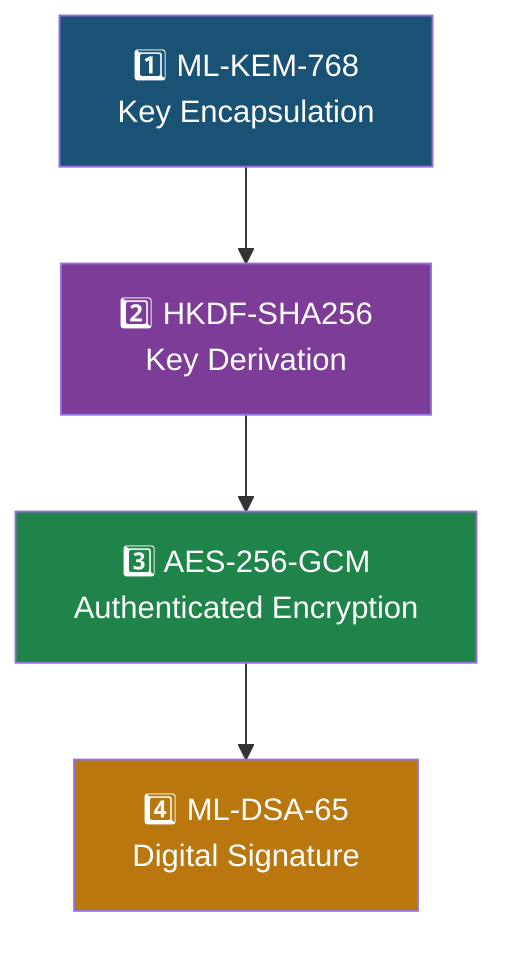

# Post-Quantum Cryptography (PQC) — Detailed Implementation Explanation

## 1. What Problem Does PQC Solve Here?

In a Federated Learning system, clients send **model updates** (gradient deltas) to a central server. These updates are sensitive — an attacker could:

- **Eavesdrop** on updates to reverse-engineer training data (confidentiality breach)
- **Forge** updates to poison the global model (integrity/authentication breach)
- **Replay/reorder** old updates to disrupt training (replay attack)

Traditional cryptography (RSA, ECDSA) is vulnerable to quantum computers running Shor's algorithm. This project uses **NIST-standardized post-quantum algorithms** to provide quantum-resistant security.

---

## 2. The Two PQC Algorithms Used

### ML-KEM-768 (formerly Kyber-768) — Key Encapsulation

| Property | Value |
|---|---|
| **Purpose** | Securely establish a shared secret between client and server |
| **NIST Standard** | FIPS 203 |
| **Security Level** | NIST Level 3 (equivalent to AES-192) |
| **Public Key Size** | 1,184 bytes |
| **Secret Key Size** | 2,400 bytes |
| **Ciphertext Size** | 1,088 bytes |
| **Shared Secret Size** | 32 bytes |
| **Hardness** | Module Learning With Errors (MLWE) problem |

**Config**: Set in [config.py](file:///c:/Users/chanikya/Desktop/btp/config.py#L42) as `ML_KEM_VARIANT = 'ML-KEM-768'`

### ML-DSA-65 (formerly Dilithium-3) — Digital Signatures

| Property | Value |
|---|---|
| **Purpose** | Authenticate that an update genuinely came from a specific client |
| **NIST Standard** | FIPS 204 |
| **Security Level** | NIST Level 3 |
| **Public Key Size** | 1,952 bytes |
| **Secret Key Size** | 4,032 bytes |
| **Signature Size** | 2,420 bytes (approx) |
| **Hardness** | Module Learning With Errors (MLWE) + Short Integer Solution (SIS) |

**Config**: Set in [config.py](file:///c:/Users/chanikya/Desktop/btp/config.py#L43) as `ML_DSA_VARIANT = 'ML-DSA-65'`

---

## 3. How liboqs Is Used

The project uses [liboqs-python](https://github.com/open-quantum-safe/liboqs-python), which is a Python wrapper around the Open Quantum Safe (OQS) C library. It provides implementations of all NIST-standardized PQC algorithms.

### Import and Availability Check — [pqc.py:28-48](file:///c:/Users/chanikya/Desktop/btp/pqc.py#L28-L48)

```python
try:
    import oqs                    # liboqs-python package
    PQC_AVAILABLE = True
except ImportError:
    PQC_AVAILABLE = False         # Falls back to mock mode
```

The system has a **graceful degradation** design — if `liboqs-python` is not installed, it uses mock/simulated crypto so the FL framework still runs (useful for development/testing).

### liboqs API Calls Used

The project uses exactly **4 core API methods** from liboqs:

#### a) `oqs.KeyEncapsulation(algorithm_name)` — [pqc.py:219](file:///c:/Users/chanikya/Desktop/btp/pqc.py#L219)

Creates a KEM instance for the specified algorithm. Used twice:
- Once in `__init__` to create the server's persistent KEM instance
- Once per `encapsulate()` call to create a fresh client-side instance

```python
self.kem = oqs.KeyEncapsulation(self.ml_kem_variant)  # e.g., 'ML-KEM-768'
```

#### b) `oqs.Signature(algorithm_name)` — [pqc.py:220](file:///c:/Users/chanikya/Desktop/btp/pqc.py#L220)

Creates a signature instance for the specified algorithm:

```python
self.sig = oqs.Signature(self.ml_dsa_variant)  # e.g., 'ML-DSA-65'
```

#### c) KEM Operations

| liboqs Method | Wrapper in pqc.py | Who Calls It | What It Does |
|---|---|---|---|
| `kem.generate_keypair()` | [generate_kem_keypair()](file:///c:/Users/chanikya/Desktop/btp/pqc.py#L230-L248) | **Server** at init | Returns the public key; loads secret key internally |
| `kem.export_secret_key()` | [generate_kem_keypair()](file:///c:/Users/chanikya/Desktop/btp/pqc.py#L242) | **Server** at init | Exports the secret key bytes for storage |
| `kem.encap_secret(public_key)` | [encapsulate()](file:///c:/Users/chanikya/Desktop/btp/pqc.py#L277-L296) | **Client** each round | Takes server's pub key → returns (ciphertext, shared_secret) |
| `kem.decap_secret(ciphertext)` | [decapsulate()](file:///c:/Users/chanikya/Desktop/btp/pqc.py#L298-L318) | **Server** each round | Takes KEM ciphertext → returns same shared_secret |

#### d) Signature Operations

| liboqs Method | Wrapper in pqc.py | Who Calls It | What It Does |
|---|---|---|---|
| `sig.generate_keypair()` | [generate_sig_keypair()](file:///c:/Users/chanikya/Desktop/btp/pqc.py#L250-L271) | **Each client** at init | Returns public key; loads secret key internally |
| `sig.export_secret_key()` | [generate_sig_keypair()](file:///c:/Users/chanikya/Desktop/btp/pqc.py#L265) | **Each client** at init | Exports secret key bytes |
| `sig.sign(message)` | [sign()](file:///c:/Users/chanikya/Desktop/btp/pqc.py#L324-L347) | **Client** each round | Signs bytes → returns signature |
| `sig.verify(msg, sig, pub_key)` | [verify()](file:///c:/Users/chanikya/Desktop/btp/pqc.py#L349-L371) | **Server** each round | Verifies signature → returns bool |

---

## 4. The Complete Cryptographic Pipeline

The full security construction uses **4 layers** stacked together:



### Layer 1: ML-KEM-768 Key Encapsulation — [pqc.py:277-318](file:///c:/Users/chanikya/Desktop/btp/pqc.py#L277-L318)

**Purpose**: Establish a shared secret between client and server without ever transmitting it.

**How it works**:
1. Server generates a KEM key pair at startup → shares **public key** with all clients
2. Each round, the client calls `encap_secret(server_pub_key)` which:
   - Generates a random 32-byte **shared secret** internally
   - Encrypts it using the server's public key → produces a **KEM ciphertext** (1,088 bytes)
   - Returns both `(kem_ciphertext, shared_secret)`
3. Server calls `decap_secret(kem_ciphertext)` using its secret key → recovers the **same shared secret**

> [!IMPORTANT]
> A fresh shared secret is generated for **every single update** from every client in every round. This provides **forward secrecy** — compromising the server's long-term KEM key doesn't reveal past session keys.

### Layer 2: HKDF-SHA256 Key Derivation — [pqc.py:64-95](file:///c:/Users/chanikya/Desktop/btp/pqc.py#L64-L95)

**Purpose**: Transform the raw KEM shared secret into a proper AES-256 key.

**Why not use the raw shared secret directly?**
- The KEM output might have biased distribution
- HKDF provides cryptographic extraction + expansion per RFC 5869

```python
def _derive_aes_key(shared_secret, info=b"FL-ML-KEM-AES256GCM"):
    hkdf = HKDF(
        algorithm=SHA256(),
        length=32,          # 256-bit output for AES-256
        salt=None,          # Zero-filled salt
        info=info,          # Context string binding key to purpose
    )
    return hkdf.derive(shared_secret)
```

The `info` parameter `b"FL-ML-KEM-AES256GCM"` is a **domain separator** — it ensures that even if the same shared secret were used in a different protocol, the derived keys would be different.

### Layer 3: AES-256-GCM Authenticated Encryption — [pqc.py:102-174](file:///c:/Users/chanikya/Desktop/btp/pqc.py#L102-L174)

**Purpose**: Encrypt the model update AND ensure it hasn't been tampered with.

**GCM (Galois/Counter Mode)** provides both:
- **Confidentiality**: The plaintext is encrypted
- **Integrity**: A 128-bit authentication tag is appended; any modification causes decryption to fail

```python
def encrypt_update(data, shared_secret, aad=b""):
    key = _derive_aes_key(shared_secret)    # 256-bit key from HKDF
    nonce = os.urandom(12)                   # 96-bit random nonce
    aesgcm = AESGCM(key)
    ciphertext = aesgcm.encrypt(nonce, data, aad)  # includes GCM tag
    return nonce, ciphertext
```

**AAD (Associated Authenticated Data)** — [pqc.py:462-469](file:///c:/Users/chanikya/Desktop/btp/pqc.py#L462-L469):
```python
aad = client_id.to_bytes(4, 'big') + round_num.to_bytes(4, 'big')
```
The AAD is **not encrypted** but IS **authenticated**. This means:
- An attacker cannot swap a ciphertext from client 3 into client 7's slot
- An attacker cannot replay a round 5 ciphertext in round 12
- Any mismatch raises `InvalidTag` during decryption

### Layer 4: ML-DSA-65 Digital Signature — [pqc.py:324-371](file:///c:/Users/chanikya/Desktop/btp/pqc.py#L324-L371)

**Purpose**: Prove the update came from a specific authenticated client.

The signature covers a **bound payload** — [pqc.py:439-459](file:///c:/Users/chanikya/Desktop/btp/pqc.py#L439-L459):

```
signed_message = client_id (4 bytes, big-endian)
               ‖ round_num (4 bytes, big-endian)
               ‖ kem_ciphertext (1,088 bytes)
               ‖ nonce (12 bytes)
               ‖ encrypted_update (variable length)
```

> [!NOTE]
> By including ALL metadata in the signed payload, the system prevents:
> - **Replay attacks**: Can't reuse a signed message from a different round
> - **Reorder attacks**: Can't swap messages between clients
> - **Impersonation**: Only the client with the secret key can produce a valid signature

---

## 5. End-to-End Data Flow in a Single FL Round

Here is how PQC integrates with the federated learning loop, traced through [federated_learning.py](file:///c:/Users/chanikya/Desktop/btp/federated_learning.py):

```mermaid
sequenceDiagram
    participant S as Server
    participant C as Client
    
    Note over S: Startup: generate ML-KEM keypair
    Note over C: Startup: generate ML-DSA keypair
    C->>S: Register ML-DSA public key
    S->>C: Share ML-KEM public key
    
    rect rgb(40, 40, 80)
    Note over S,C: Each FL Round
    S->>C: Broadcast global model weights
    
    Note over C: 1. Local training
    Note over C: 2. Compute update delta
    
    Note over C: 3. KEM: encap_secret(server_pub_key)<br/>→ (kem_ct, shared_secret)
    Note over C: 4. HKDF: derive AES key from shared_secret
    Note over C: 5. AES-GCM: encrypt(update, key, aad)
    Note over C: 6. ML-DSA: sign(bound_payload)
    
    C->>S: EncryptedUpdate { kem_ct, nonce, ciphertext, signature, client_id, round_num }
    
    Note over S: 7. ML-DSA: verify(bound_payload, sig, client_pub_key)
    Note over S: 8. KEM: decap_secret(kem_ct) → shared_secret
    Note over S: 9. HKDF: derive AES key from shared_secret
    Note over S: 10. AES-GCM: decrypt(ciphertext, key, aad)
    Note over S: 11. Deserialize → torch.Tensor
    Note over S: 12. Aggregate updates → update global model
    end
```



### Step-by-Step Code Trace

#### A. Server Initialization — [federated_learning.py:280-285](file:///c:/Users/chanikya/Desktop/btp/federated_learning.py#L280-L285)

```python
# Server generates ML-KEM keypair (for clients to encrypt TO the server)
self.pqc = PostQuantumCrypto() if PQC_ENABLED else None
if self.pqc and ENCRYPT_MESSAGE:
    self.kem_pub_key, self.kem_sec_key = self.pqc.generate_kem_keypair()
```

Internally this calls:
```python
public_key = self.kem.generate_keypair()    # liboqs: generates lattice-based keypair
secret_key = self.kem.export_secret_key()   # liboqs: exports the secret key bytes
```

#### B. Client Initialization — [federated_learning.py:60-64](file:///c:/Users/chanikya/Desktop/btp/federated_learning.py#L60-L64)

```python
# Each client generates ML-DSA keypair (for signing updates)
self.pqc = PostQuantumCrypto() if PQC_ENABLED else None
if self.pqc and SIGN_MESSAGE:
    self.sig_pub_key, self.sig_sec_key = self.pqc.generate_sig_keypair()
```

#### C. Client Encrypts & Signs — [federated_learning.py:182-236](file:///c:/Users/chanikya/Desktop/btp/federated_learning.py#L182-L236)

The method `encrypt_and_sign_update()` orchestrates all 4 crypto layers:

```python
def encrypt_and_sign_update(self, update, server_kem_pub_key):
    update_bytes = serialize_update(update)        # Tensor → bytes via pickle
    aad = EncryptedUpdate.build_aad(self.client_id, round_num)  # 8-byte AAD

    # LAYER 1+2+3: KEM → HKDF → AES-GCM
    kem_ciphertext, shared_secret = self.pqc.encapsulate(server_kem_pub_key)
    nonce, encrypted_update = encrypt_update(update_bytes, shared_secret, aad=aad)

    # LAYER 4: Sign the ENTIRE bound payload
    bound_msg = EncryptedUpdate.build_bound_message(
        self.client_id, round_num, kem_ciphertext, nonce, encrypted_update
    )
    signature = self.pqc.sign(bound_msg)

    return EncryptedUpdate(
        client_id=self.client_id,
        encrypted_update=encrypted_update,
        signature=signature,
        kem_ciphertext=kem_ciphertext,
        nonce=nonce,
        round_num=round_num,
    )
```

#### D. Server Verifies & Decrypts — [federated_learning.py:304-395](file:///c:/Users/chanikya/Desktop/btp/federated_learning.py#L304-L395)

```python
def verify_and_decrypt_updates(self, encrypted_updates, round_num):
    for enc_update in encrypted_updates:
        # Reconstruct the bound message from the received fields
        bound_msg = EncryptedUpdate.build_bound_message(
            client_id, msg_round, kem_ciphertext, nonce, encrypted_data
        )

        # VERIFY FIRST (fail-fast: don't waste CPU on forged messages)
        is_valid = self.pqc.verify(bound_msg, signature, client_pub_key)
        if not is_valid:
            continue  # DROP the update — possible attack

        # DECRYPT only after verification passes
        shared_secret = self.pqc.decapsulate(kem_ciphertext)    # KEM decap
        decrypted_data = decrypt_update(nonce, encrypted_data,
                                        shared_secret, aad=aad) # AES-GCM

        update = deserialize_update(decrypted_data)              # bytes → Tensor
```

> [!TIP]
> The server **verifies the signature BEFORE decrypting**. This is a deliberate design choice — signature verification is cheaper than KEM decapsulation + AES decryption, so forged messages are rejected early without wasting compute.

---

## 6. The `EncryptedUpdate` Container — [pqc.py:396-469](file:///c:/Users/chanikya/Desktop/btp/pqc.py#L396-L469)

This class is the **wire format** — everything a client sends to the server in one update:

```
┌──────────────────────────────────────────────────────────┐
│                   EncryptedUpdate                        │
├──────────────────┬───────────────────────────────────────┤
│ client_id        │ int — who sent this                   │
│ round_num        │ int — which FL round                  │
│ kem_ciphertext   │ 1,088 bytes — ML-KEM encapsulation   │
│ nonce            │ 12 bytes — AES-GCM nonce              │
│ encrypted_update │ variable — AES-GCM ciphertext + tag   │
│ signature        │ ~2,420 bytes — ML-DSA signature       │
│ timestamp        │ float — Unix creation time             │
└──────────────────┴───────────────────────────────────────┘
```

---

## 7. Security Properties Achieved

| Property | Mechanism | Attack Prevented |
|---|---|---|
| **Confidentiality** | ML-KEM-768 + HKDF + AES-256-GCM | Eavesdropping on model updates |
| **Integrity** | AES-GCM authentication tag (128-bit) | Tampering with encrypted updates |
| **Authentication** | ML-DSA-65 signature | Impersonation / forged updates |
| **Replay Prevention** | `round_num` in AAD + signed payload | Replaying old updates |
| **Reorder Prevention** | `client_id` in AAD + signed payload | Swapping updates between clients |
| **Forward Secrecy** | Fresh KEM encapsulation per update | Past sessions safe if key leaks |
| **Quantum Resistance** | ML-KEM + ML-DSA (lattice-based) | Shor's algorithm on quantum computers |

---

## 8. Mock/Fallback Mode

When `liboqs-python` is not installed, the system operates in **mock mode** — [pqc.py:56-57](file:///c:/Users/chanikya/Desktop/btp/pqc.py#L56-L57):

```python
_MOCK_SS = bytes(range(32))     # Fixed 32-byte shared secret
_MOCK_CT = os.urandom(1088)     # Fixed mock ciphertext
```

| Operation | Mock Behavior |
|---|---|
| `generate_kem_keypair()` | Returns random bytes of correct sizes |
| `generate_sig_keypair()` | Returns random bytes of correct sizes |
| `encapsulate()` | Returns `(_MOCK_CT, _MOCK_SS)` |
| `decapsulate()` | Returns `_MOCK_SS` |
| `sign()` | Returns `os.urandom(2420)` |
| `verify()` | Always returns `True` |

Similarly, if the `cryptography` library is missing, AES-GCM falls back to **XOR encryption** (with a warning) — [pqc.py:133-137](file:///c:/Users/chanikya/Desktop/btp/pqc.py#L133-L137).

> [!CAUTION]
> Mock mode provides **zero actual security**. It exists only so the FL framework can run for development/testing when the crypto dependencies are not installed.

---

## 9. Configuration Flags — [config.py:40-45](file:///c:/Users/chanikya/Desktop/btp/config.py#L40-L45)

| Flag | Default | Effect |
|---|---|---|
| `PQC_ENABLED` | `True` | Master switch for all PQC operations |
| `ML_KEM_VARIANT` | `'ML-KEM-768'` | Which KEM algorithm to use |
| `ML_DSA_VARIANT` | `'ML-DSA-65'` | Which signature algorithm to use |
| `SIGN_MESSAGE` | `True` | Enable/disable ML-DSA signing |
| `ENCRYPT_MESSAGE` | `True` | Enable/disable ML-KEM + AES-GCM encryption |

When `PQC_ENABLED = False`, no crypto operations are performed — updates are sent as plaintext serialized tensors.

---

## 10. Overhead Measurement

The system tracks PQC performance overhead via metrics dictionaries:

**Client-side** — [federated_learning.py:66-71](file:///c:/Users/chanikya/Desktop/btp/federated_learning.py#L66-L71):
- `encryption_time[]` — Time for KEM encapsulation + AES-GCM encryption
- `signature_time[]` — Time for ML-DSA signing

**Server-side** — [federated_learning.py:288-294](file:///c:/Users/chanikya/Desktop/btp/federated_learning.py#L288-L294):
- `decryption_time[]` — Time for KEM decapsulation + AES-GCM decryption
- `verification_time[]` — Time for ML-DSA signature verification
- `num_valid_updates[]` — How many updates passed verification
- `num_invalid_signatures[]` — How many were rejected

---

## Summary

```
Install: pip install liboqs-python cryptography

liboqs provides:     ML-KEM-768 (Kyber)    → quantum-safe key exchange
                     ML-DSA-65 (Dilithium) → quantum-safe digital signatures

cryptography provides: AES-256-GCM          → authenticated symmetric encryption
                       HKDF-SHA256          → secure key derivation

Pipeline: KEM → HKDF → AES-GCM → Sign (client)
          Verify → KEM → HKDF → AES-GCM (server)
```
